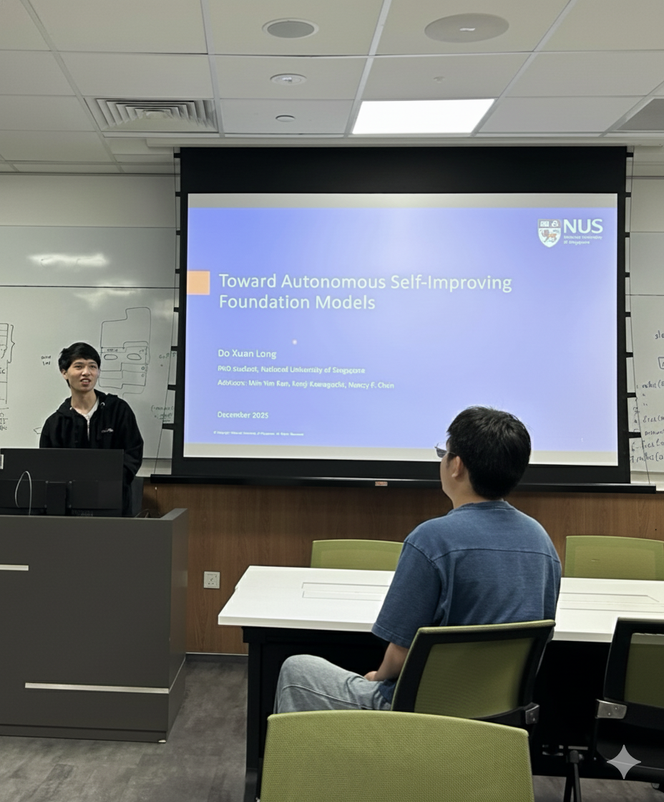

NUS AI Seminar at the Computer Science Department is a new initiative to bring together AI researchers to share their latest research findings and insights. There are eight speakers in the Fall 2025 semester, usually hosted on Wednesday afternoons at Seminar Room 21. WING members are excited to present their research alongside other presenters from NUS Computing, MIT, and UCLA. We appreciate [Prof. Lee Wee Sun](https://www.comp.nus.edu.sg/~leews/) and PhD student [Guoji Fu](https://scholar.google.com/citations?hl=en&user=a8CLpC0AAAAJ&view_op=list_works&sortby=pubdate) for hosting the seminar.

[Yisong Miao](https://wing.comp.nus.edu.sg/author/yisong-miao/) gave a seminar presentation titled "Faithfulness and Interpretability for Discourse Understanding" on November 19th, 2025. This talk combines his work on [Discursive Socratic Questioning (ACL 2024)](https://aclanthology.org/2024.acl-long.341/) and [Discursive Circuits (EMNLP 2025)](https://aclanthology.org/2025.emnlp-main.1657/). He explained how our team tackles the technical challenge of evaluating a model's discourse faithfulness and formalizing a unique setup for transformer circuit discovery. The seminar ends with an audience discussion on the conceptual difference between truthfulness and faithfulness, as well as designing new methods using sparse circuits in future work.

[Yajing Yang](https://wing.comp.nus.edu.sg/author/yajing-yang/) presented "Financial Report Generation with LLM", also on November 19th, 2025, highlighting her research on financial data narration. Drawing from [DataTales: A Benchmark for Real-World Intelligent Data Narration (EMNLP 2024)](https://aclanthology.org/2024.emnlp-main.601/) and [KAHAN: Knowledge-Augmented Hierarchical Analysis and Narration for Financial Data Narration (EMNLP 2025)](https://aclanthology.org/2025.findings-emnlp.1405/), she described our team's efforts to build a realistic benchmark and improve generation quality through knowledge integration and hierarchical analysis. The talk sparked discussion on remaining challenges in financial report generation and how LLMs could be used to produce more actionable and informative insights.

On December 3rd, 2025, [Xuan Long Do](https://aclanthology.org/people/xuan-long-do/) delivered a seminar titled "Toward Autonomous Self-Improving Foundation Models". The presentation spanned multiple projects, including ["What Makes a Good Natural Language Prompt?" (ACL 2025)](https://aclanthology.org/2025.acl-long.292/), [Multi-Expert Prompting (EMNLP 2024)](https://aclanthology.org/2024.emnlp-main.1135/), and [VISTA, his 2025 Google internship project](https://arxiv.org/abs/2510.15831) on a self-improving video generation agent. Beginning with an analysis of prompt and model fragility, he showed how multi-agent reasoning can help address these limitations before moving toward the broader vision of autonomous self-improving foundation models. The seminar concluded with an audience discussion on future research directions in this area.

_Below is a gallery of the seminar photos, some of which are enhanced and regenerated via Google's Nano Banana_

Yisong Miao presenting his work on Faithfulness and Interpretability for Discourse Understanding at the AI Seminar on November 19th, 2025:

Yajing Yang presenting her work on Financial Report Generation with LLM at the AI Seminar on November 19th, 2025:

Xuan Long Do presenting his work on Toward Autonomous Self-Improving Foundation Models at the AI Seminar on December 3rd, 2025:

