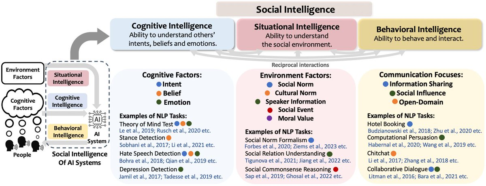

Big news from WING: our group at NUS Computing, in collaboration with [Prof. Diyi Yang](https://saltlab.stanford.edu/) at Stanford, has received funding support under [Singapore's AI Visiting Professorship (AIVP)](https://www.comp.nus.edu.sg/news/six-nus-computing-faculty-receive-grants-under-singapores-ai-visiting-professorship-aivp/).

<!--more-->

The grant supports our collaboration with Prof. Diyi Yang on **socially intelligent foundation models**, including work that advances their cognitive, situational, and behavioral intelligence.

As AI systems become increasingly integrated into human life, there is a growing need to evaluate and build socially intelligent foundation models that are socially aware and human-centered.

Funded by the Ministry of Digital Development and Information, the project, "Evaluating and Building Socially Intelligent Foundation Models," works toward more trustworthy, human-centered AI. We are excited about what comes next.

[Read more](https://www.comp.nus.edu.sg/news/six-nus-computing-faculty-receive-grants-under-singapores-ai-visiting-professorship-aivp/): five other professors from the NUS School of Computing were also awarded AIVP grants in the same round, six in all.
